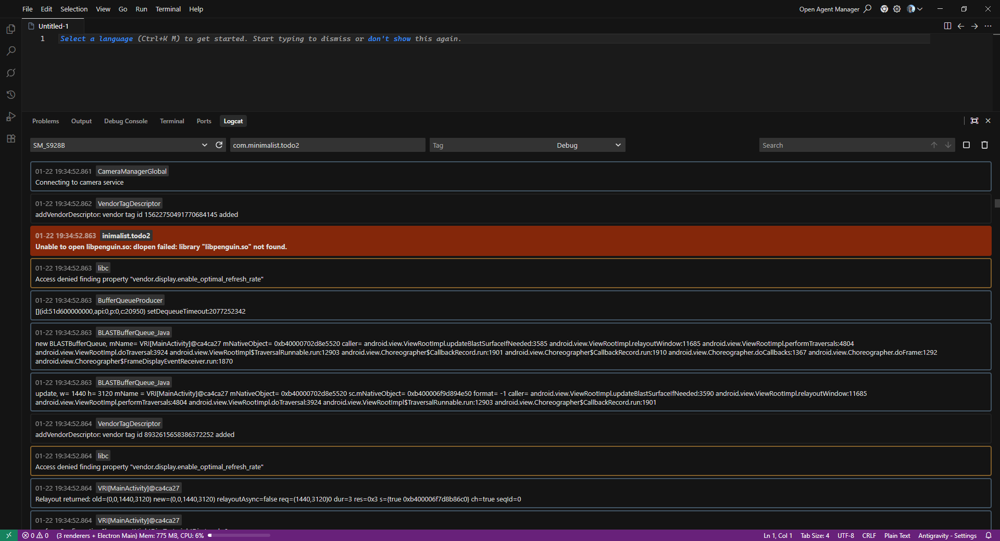

# VSC Logcat

**VSC Logcat** is a lightweight Visual Studio Code extension that allows you to view and filter Android Logcat logs directly within your editor. It provides a clean, native-feeling interface to stream logs from connected devices without leaving your coding environment.

## Features

- **Device Selection**: Automatically detects and lists connected Android devices via ADB.
- **Log Streaming**: View logs as they happen with auto-scrolling capabilities.
- **Filtering**:
  - **Package Name**: Focus on a specific application by filtering by its package name (e.g., `com.android.chrome`).
  - **Log Tag**: Filter logs by specific tags.
  - **Log Level**: Filter by priority levels: `Verbose`, `Debug`, `Info`, `Warning`, `Error`, `Fatal`.
- **Search**: search functionality to highlight and navigate through log matches.
- **Log Buffer**: handles large volumes of logs with a circular buffer.

## Requirements

This extension relies on the **Android Debug Bridge (ADB)**.
- **ADB** must be installed on the machine and added to the system's `PATH`.

## Usage

1. **Open the Logcat View**:
   - Click on the **Logcat** tab in the bottom panel.

2. **Select a Device**:
   - Choose your connected Android device from the dropdown list.
   - If your device doesn't appear, ensure it is connected and authorized, then click the **Refresh** button.

3. **Configure Filters**:
   - **Package Name**: Enter the package name of the app you want to debug (e.g., `com.example.myapp`). **(Required)**
   - **Tag**: (Optional) Enter a specific log tag to filter by.
   - **Level**: Select the minimum log level (default is `Debug`).

4. **Start The Logcat Stream**:
   - Click the **Play** (Start) button to begin streaming logs.
   - Use the **Stop** button to pause the stream.
   - Use the **Clear** button to wipe the current log view.

## Screenshot

